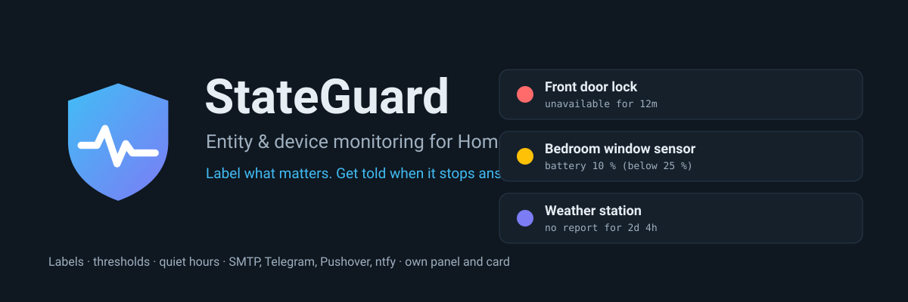
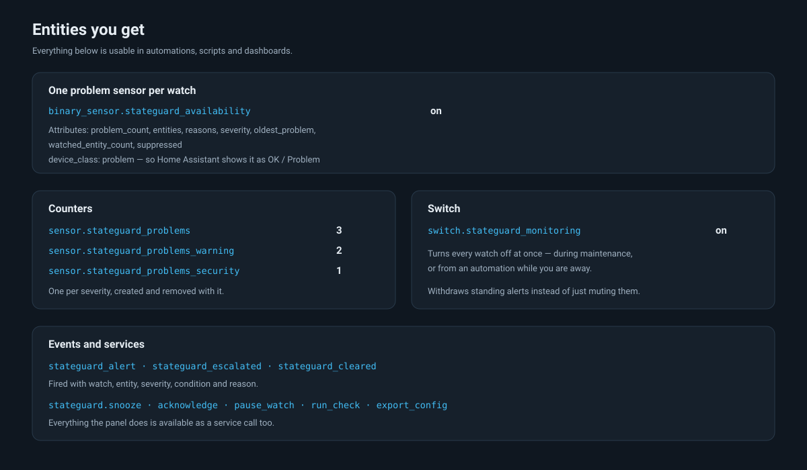
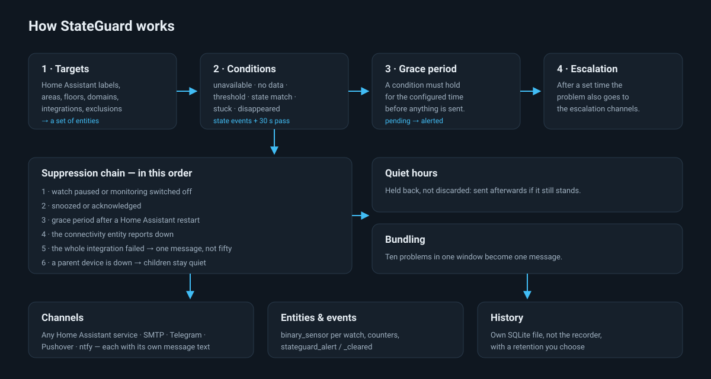
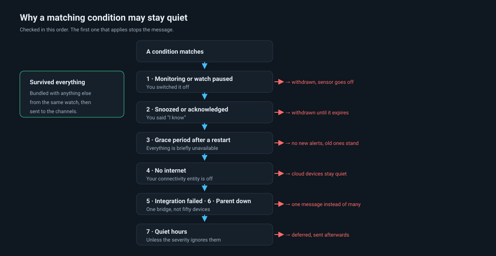
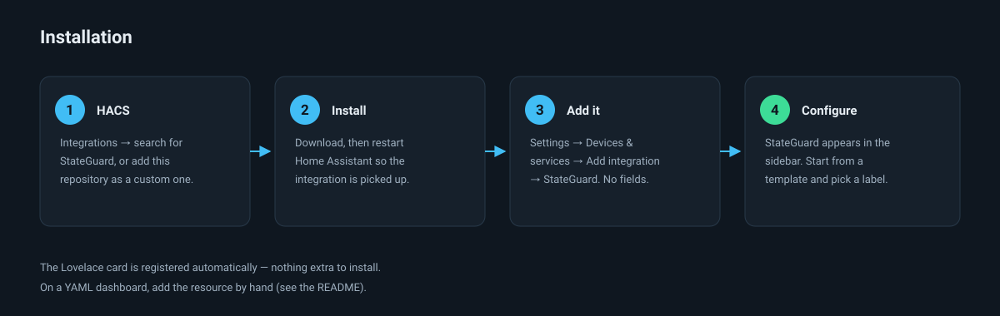
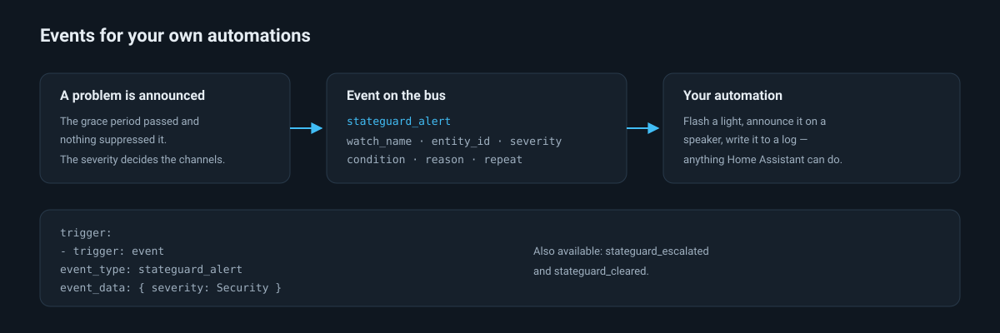
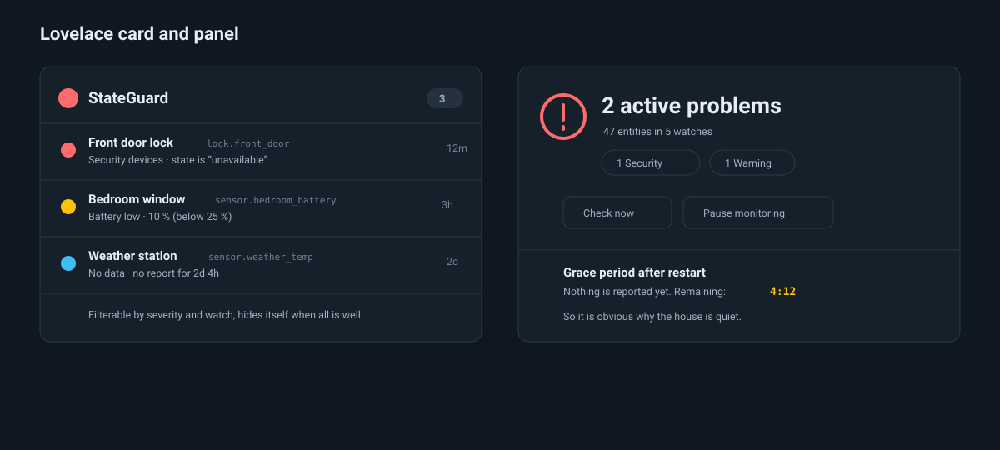

<div align="center">
  

  # StateGuard — Entity & Device Monitoring for Home Assistant

  **Label the devices that matter, and StateGuard tells you when they stop answering.**
  A custom integration that watches Home Assistant labels for entities going unavailable, falling silent, or crossing a threshold — with its own panel, its own Lovelace card, and notifications through SMTP, Telegram, Pushover, ntfy or any Home Assistant service.

  [](https://hacs.xyz)
  [](https://github.com/sphings79/stateguard-home-assistant/releases)
  [](https://www.home-assistant.io)
  [](LICENSE)

  **English** · [Deutsch](README.de.md)
</div>

## Table of contents

- [What this integration does](#what-this-integration-does)
- [Why not just an automation](#why-not-just-an-automation)
- [Entities you get](#entities-you-get)
- [How it works](#how-it-works)
- [Why a matching problem may stay quiet](#why-a-matching-problem-may-stay-quiet)
- [Installation](#installation)
- [Configuration](#configuration)
- [Notification channels](#notification-channels)
- [Automation examples](#automation-examples)
- [Dashboard example](#dashboard-example)
- [Services](#services)
- [Troubleshooting](#troubleshooting)
- [FAQ](#faq)
- [More Home Assistant projects](#more-home-assistant-projects)
- [Contributing](#contributing)
- [Disclaimer](#disclaimer)
- [License](#license)

## What this integration does

A battery dies. A Zigbee device drops off. A sensor keeps reporting the same value for two days because it is actually dead. Home Assistant will happily show `unavailable` forever and never mention it.

StateGuard watches the entities you label and tells you when something is wrong:

| Condition | What it catches |
| --- | --- |
| **Unavailable or unknown** | A device fell off the network or its integration broke |
| **No data for too long** | The entity still exists but has stopped reporting |
| **Numeric threshold** | Battery below 25 %, temperature above 60 °C, with a separate recovery value so it does not flap |
| **State is (not)** | A door reporting something other than `closed` |
| **Stuck in a state** | A lock that has been `unlocked` for over an hour |
| **Entity disappeared** | An entity id that no longer exists at all |

Each watch has a **severity** you define yourself. A temperature sensor and a front door lock are not the same kind of problem, so they do not have to share alerting rules, channels or quiet hours.

## Why not just an automation

You can build one watch as an automation. The awkward parts are what comes after:

- Not waking you at 3 a.m. for a sensor that will still be broken at 8.
- Not sending fifty messages when one Zigbee coordinator drops off.
- Not alerting for ten minutes after every Home Assistant restart, when half the house is briefly `unavailable`.
- Battery levels that report in steps of 25 % and would otherwise flap around the threshold.
- Keeping a record of what broke, when, and for how long.

StateGuard is that second half, done once, configured in a panel instead of in YAML.

## Entities you get



| Entity | Example | Meaning |
| --- | --- | --- |
| `binary_sensor.stateguard_<watch>` | `on` | This watch has active problems. Attributes list the affected entities and why. |
| `sensor.stateguard_problems` | `3` | Active problems in total |
| `sensor.stateguard_problems_<severity>` | `1` | Active problems of one severity |
| `switch.stateguard_monitoring` | `on` | Pauses every watch at once |

## How it works



Two things drive the checks. State changes are picked up immediately, and a pass every 30 seconds handles what has no event of its own — an entity that has gone quiet, a grace period running out, an escalation coming due.

The "no data" check measures against **`last_reported`**, not `last_changed`. That distinction matters: a Homematic battery sensor may sit at 75 % for three days while reporting faithfully every half hour. Measured against `last_changed`, it would look dead.

## Why a matching problem may stay quiet



There is a difference between the two kinds:

- **You asked for it** — monitoring off, watch paused, snoozed, acknowledged. A standing alert is *withdrawn*: the sensor goes off and the notification disappears.
- **The system decided** — restart grace period, no internet, integration down, parent device down. Only *new* alerts are held back. Something already announced stays announced, so a restart never re-notifies you about problems you already know about.

**Quiet hours are neither**: the message is deferred and sent afterwards, but only if the problem still stands. You can define several periods, because weekends usually differ — 22:00–07:00 Monday to Friday, 23:00–09:00 at the weekend. A period that crosses midnight belongs to the day it starts on, so "Friday 23:00–07:00" covers the early hours of Saturday.

## Installation



### Through HACS

1. HACS → Integrations → ⋮ → **Custom repositories**
2. Add `https://github.com/sphings79/stateguard-home-assistant`, category **Integration**
3. Install **StateGuard**, then restart Home Assistant
4. Settings → Devices & services → **Add integration** → StateGuard

There is nothing to fill in — everything else happens in the panel.

### Manually

Copy `custom_components/stateguard` into your `config/custom_components/` directory and restart.

## Configuration

Everything lives in the **StateGuard** entry in the sidebar (admins only).

### Start from a template

Five templates cover the usual cases: Availability, Battery low, No data, Security devices, Missing entities. Pick one, choose your labels, save. The battery template defaults to **25 %** rather than 20 %, because many devices report in coarse steps (Homematic uses 100 / 75 / 50 / 37.5 / 25 / 0) and a limit of 20 % would only ever fire at zero.

### What a watch selects

Labels are the main selector, and the editor shows a **live preview** of exactly which entities the current selection covers — before you save.

| Setting | Effect |
| --- | --- |
| Labels + matching | Any of them, or all of them |
| Entities of labelled devices | A label on a device covers its entities |
| Diagnostic entities | Off by default, so signal strength sensors stay out of the way |
| Areas, floors, domains, integrations | Narrows the label selection further |
| Individual entities | Added on top |
| Exclusions | An ignore label, or specific entity ids |

Filled-in categories combine with **AND**; individually listed entities are added with **OR**.

### Who can see it

By default the sidebar entry is for administrators only. In the settings you
can open it to everyone — non-administrators then get a read-only overview and
cannot change anything. Editing stays with administrators either way, and the
change takes effect without a restart.

The **Lovelace card works for every user regardless of this setting**, so you
can put the current problems on a family dashboard without handing out the
configuration.

### Severities

Freely definable, each with a priority that decides who wins when two watches cover the same entity. Attached to a severity: its channels, whether it ignores quiet hours, whether it raises a Home Assistant notification, the bundling window, the repeat interval, and the escalation step.

## Notification channels

| Channel | Credentials stored | Notes |
| --- | --- | --- |
| **Home Assistant service** | none | `notify.mobile_app_…`, a configured Telegram bot, the SMTP integration, a script — anything with a service |
| **SMTP** | in StateGuard | Direct mail through your own server, independent of Home Assistant |
| **Telegram** | in StateGuard | Your own bot token and chat id |
| **Pushover** | in StateGuard | Application token and user key, with priority and sound |
| **ntfy** | in StateGuard | ntfy.sh or your own server, with tags and click-through |

Every channel can carry its own message text as a Jinja2 template with `watch`, `severity`, `count` and `problems` (each with `name`, `entity_id`, `state`, `reason`, `device`, `integration`, `url`). Leave it empty for the built-in wording, which follows your Home Assistant language.

Each channel has a **Send test** button, so you find out that the token is wrong now rather than during the next outage.

## Automation examples



Flash a light when a security device fails:

```yaml
automation:
  - alias: "Flash on security alert"
    trigger:
      - trigger: event
        event_type: stateguard_alert
        event_data:
          severity: Security
    action:
      - action: light.turn_on
        target: { entity_id: light.hallway }
        data: { flash: long, color_name: red }
```

Announce the count when you get home:

```yaml
automation:
  - alias: "Report problems on arrival"
    trigger:
      - trigger: state
        entity_id: person.me
        to: home
    condition:
      - condition: numeric_state
        entity_id: sensor.stateguard_problems
        above: 0
    action:
      - action: tts.speak
        data:
          message: >-
            {{ states('sensor.stateguard_problems') }} devices need attention:
            {{ state_attr('sensor.stateguard_problems', 'entities') | join(', ') }}
```

Pause monitoring while you are working on the network:

```yaml
action:
  - action: stateguard.snooze
    data:
      duration: "1h"
```

## Dashboard example



The card is registered automatically — it appears in the card picker with no resource to add:

```yaml
type: custom:stateguard-card
title: Devices needing attention
hide_when_healthy: true
severities:
  - security
  - critical
max: 5
```

| Option | Default | Meaning |
| --- | --- | --- |
| `title` | `StateGuard` | Card heading |
| `hide_when_healthy` | `false` | Hide the card entirely when nothing is wrong |
| `severities` | all | Only show these severity ids |
| `watches` | all | Only show these watch ids |
| `show_suppressed` | `false` | Also list snoozed and held-back problems |
| `max` | unlimited | Cap the number of rows |

On a **YAML-mode dashboard**, resources are not managed by Home Assistant, so add it once by hand:

```yaml
lovelace:
  resources:
    - url: /stateguard-frontend/stateguard-card.js
      type: module
```

## Services

| Service | What it does |
| --- | --- |
| `stateguard.snooze` | Mute for 1 h, 8 h, 24 h or until morning — per watch, per entity, or everything |
| `stateguard.acknowledge` | Mark as known; no further alerts until it clears |
| `stateguard.clear_acknowledgement` | Undo an acknowledgement or snooze |
| `stateguard.pause_watch` / `resume_watch` | Switch a single watch off and on |
| `stateguard.run_check` | Re-resolve targets and evaluate immediately |
| `stateguard.export_config` | Return the full configuration (response data) |
| `stateguard.import_config` | Replace the configuration from a backup |

## Troubleshooting

**Nothing is being reported.** Look at the overview — it says why. A countdown appears while the grace period after a restart is still running, and there is a banner when the connectivity entity reports down. The monitoring switch may also simply be off.

**A watch covers zero entities.** Open it: the live preview shows what the current selection resolves to. The most common cause is a label sitting on the *device* while "Include entities of labelled devices" is off, or the entities being diagnostic ones.

**A battery sensor keeps flapping.** Set a recovery value above the limit. With 25 % and a recovery of 40 %, the problem clears only once the reading is genuinely back up.

**I get an alert for every device behind one bridge.** Leave "Suppress when the parent device is down" on. StateGuard follows `via_device` upwards and stays quiet about children when the parent itself is unreachable.

**The card does not appear.** On a storage-mode dashboard it registers itself; a YAML dashboard needs the resource entry above. A hard reload (Ctrl+Shift+R) clears a cached older bundle.

## FAQ

### Does this work without an internet connection?

Yes. Everything runs locally. Only the channels you choose — Telegram, Pushover, ntfy — talk to the outside, and you can nominate a connectivity entity so those stay quiet while the line is down.

### Do I have to label everything?

No. Labels are the main selector, but a watch can also take areas, floors, domains, whole integrations, or individual entity ids.

### What happens when Home Assistant restarts?

Nothing is reported for the grace period, ten minutes by default, since many entities are briefly unavailable after a restart. Problems already announced before the restart stay announced — you are not notified twice.

### Does this replace Watchman?

They overlap. Watchman finds missing and unavailable entities on demand; StateGuard adds label-driven rules, thresholds, stale detection, escalation, quiet hours and a history. They can run side by side.

### Does it slow Home Assistant down?

It listens only to the entities your watches actually cover and runs one pass every 30 seconds over that same set. A "no data" check across a few hundred entities is a handful of timestamp comparisons.

### Where is the history stored?

In `stateguard_history.db` next to your configuration, deliberately not in the recorder database — a monitoring integration should not inflate the database everything else depends on. Retention defaults to 90 days.

### Are my passwords safe?

Channel credentials live in Home Assistant's own storage, the same place every other integration keeps its secrets. They are never sent back to the browser: the panel shows a placeholder, and leaving it untouched keeps the stored value.

### Can I use it in English and German?

Both. The panel follows your Home Assistant language and can be pinned to either in the settings. Notification texts are translated too.

## More Home Assistant projects

- [Marstek Venus Modbus](https://github.com/sphings79/marstek_venus_modbus_dev) — Marstek Venus battery storage over local Modbus TCP
- [Shelly Modbus](https://github.com/sphings79/shelly-modbus-home-assistant) — Shelly energy meters and relays over Modbus TCP, no cloud
- [MyIP.wtf](https://github.com/sphings79/myip-wtf-home-assistant) — public IPv4/IPv6, ISP and geolocation as sensors
- [Leasing KM Calculator](https://github.com/sphings79/km_leasing_check_ha) — mileage allowance for a leased car
- [Leasing KM Card](https://github.com/sphings79/leasing_km_card) — the matching Lovelace card
- [Marstek Venus BLE](https://github.com/sphings79/ha-marstek-ble) — Marstek Venus E over Bluetooth LE
- [Marstek offline endpoint](https://github.com/sphings79/Marstek-offline-endpoint) — run a Venus battery without the cloud
- [venuscontrol](https://github.com/sphings79/venuscontrol) — cloud-free web control panel over Web Bluetooth

## Contributing

Issues and pull requests are welcome. For the frontend, run `npm install` and `npm run build` inside `frontend/` — the built bundles are committed because HACS does not run a build step.

If StateGuard saves you a dead battery or a silent smoke detector, a ⭐ on the repository genuinely helps other people find it.

<a href="https://buymeacoffee.com/sphings"></a>

## Disclaimer

StateGuard is an unofficial, community-built integration. It is not affiliated with, endorsed by, or supported by the Home Assistant project or Nabu Casa, Inc. Telegram, Pushover and ntfy are operated by their respective owners; their terms of service and rate limits apply. See [NOTICE](NOTICE).

**StateGuard is a convenience, not a safety system.** Do not rely on it alone for smoke detectors, water sensors or anything else where a missed alert has real consequences.

## License

[MIT](LICENSE) © sphings79

---

<sub>Home Assistant monitoring · entity unavailable alert · device offline notification · battery low warning · sensor stopped reporting · stale entity detection · label based monitoring · HACS integration · Telegram notification · Pushover · ntfy · SMTP email alert · Lovelace card · quiet hours · escalation · incident history</sub>
